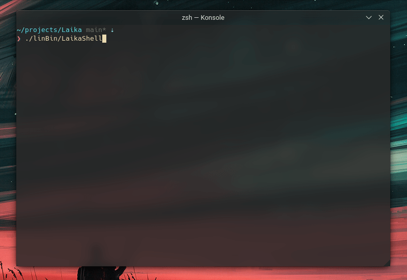

# Laika

<p align="center">
    <a href="https://github.com/CPunch/Laika/actions/workflows/check-build.yaml"></a>
    <a href="https://github.com/CPunch/Laika/blob/main/LICENSE.md"></a>
</p>

Laika is a simple Remote Access Toolkit stack for educational purposes. It allows authenticated communication across a custom protocol with generated key pairs which are embedded into the executable (only the public key is embedded in the bot client ofc). The bot client supports both Windows & Linux environments, while the shell & CNC server specifically target Linux environments.



Some notable features thus far:
- [X] Lightweight, the bot alone is 270kb (22kb if not statically linked with LibSodium) and uses very little resources minimizing Laika's footprint.
- [X] Authentication & packet encryption using LibSodium and a predetermined public CNC key.
- [X] Server and Shell configuration through `.ini` files. 
- [X] Ability to open shells remotely on the victim's machine.
- [ ] Ability to relay socket connections to/from the victim's machine.
- [ ] Uses obfuscation techniques also seen in the wild (string obfuscation, tiny VMs executing sensitive operations, etc.)
- [ ] Simple configuration using CMake
    - [X] Setting keypairs (`-DLAIKA_PUBKEY=? -DLAIKA_PRIVKEY=?`, etc.)
    - [ ] Obfuscation modes

## Would this work in real world scenarios?

My hope is that this becomes complete enough to be accurate to real RAT sources seen in the wild. However since Laika uses a binary protocol, the traffic the bot/CNC create would look very suspect and scream to sysadmins. This is why most RATs/botnets nowadays use an HTTP-based protocol, not only to 'blend in' with traffic, but it also scales well with large networks of bots where the CNC can be deployed across multiple servers and have a generic HTTP load balancer.

I could add some padding to each packet to make it look pseudo-HTTP-like, however I haven't given much thought to this.

## Directories explained

- `/cmake-modules` holds helper functions for CMake.
- `/lib` is a shared static library between the bot, shell & CNC. LibSodium is also vendor'd here.
- `/cnc` is the Command aNd Control server. (Currently only targets Linux)
- `/bot` is the bot client to be ran on the target machine. (Targets both Linux and Windows)
- `/shell` is the main shell to connect to the CNC server with to issue commands. (Currently only targets Linux)
- `/tools` holds tools for generating keypairs, etc.

## CMake Definitions

| Definition        | Description                           | Example                                                                           |
| ----------------- | ------------------------------------- | --------------------------------------------------------------------------------- |
| LAIKA_PUBKEY      | Sets CNC's public key                 | -DLAIKA_PUBKEY=997d026d1c65deb6c30468525132be4ea44116d6f194c142347b67ee73d18814   |
| LAIKA_PRIVKEY     | Sets CNC's private key                | -DLAIKA_PRIVKEY=1dbd33962f1e170d1e745c6d3e19175049b5616822fac2fa3535d7477957a841  |
| LAIKA_CNC_IP      | Sets CNC's public ip                  | -DLAIKA_CNC_IP=127.0.0.1                                                          |
| LAIKA_CNC_PORT    | Sets CNC's bind()'d port              | -DLAIKA_CNC_PORT=13337                                                            |
> examples are passed to `cmake -B <dir>`

## Configuration and compilation

Make sure you have the following libraries and tools installed:
- CMake (>=3.10)
- Compiler with C11 support (GCC >= 4.7, Clang >= 3.1, etc.)

The only dependency (LibSodium) is vender'd and statically compiled against the `/lib`. This should be kept up-to-date against stable and security related updates to LibSodium.

First, compile the target normally

```sh
$ cmake -B build && cmake --build build
```

Now, generate your custom key pair using `genKey`

```sh
$ ./bin/genKey
```

Next, rerun cmake, but passing your public and private keypairs

```sh
$ rm -rf build &&\
    cmake -B build -DLAIKA_PUBKEY=997d026d1c65deb6c30468525132be4ea44116d6f194c142347b67ee73d18814 -DLAIKA_PRIVKEY=1dbd33962f1e170d1e745c6d3e19175049b5616822fac2fa3535d7477957a841 -DCMAKE_BUILD_TYPE=MinSizeRel &&\
    cmake --build build
```

Output binaries are put in the `./bin` folder